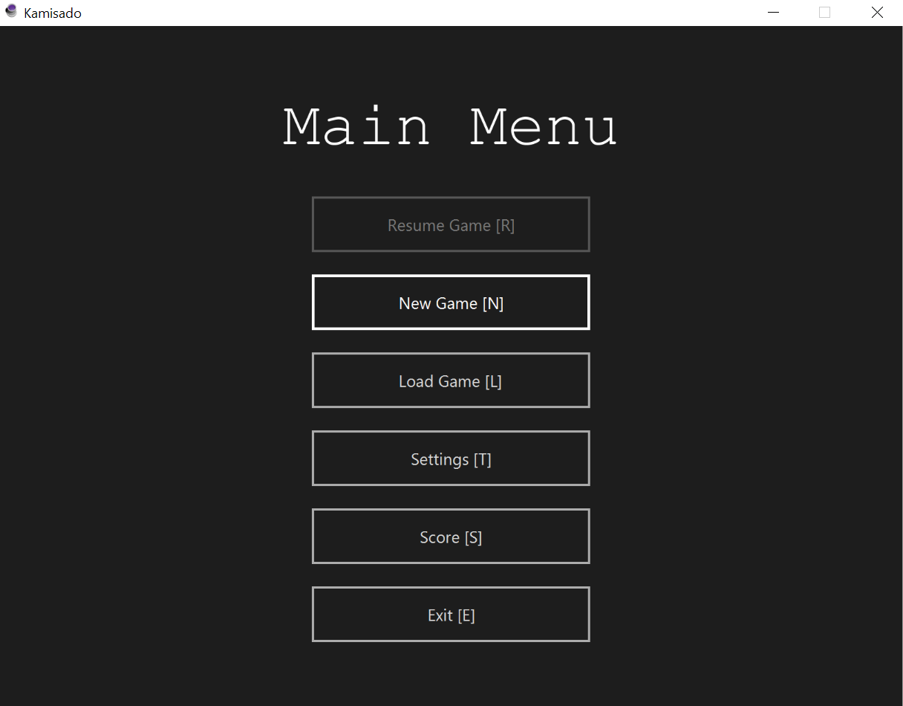
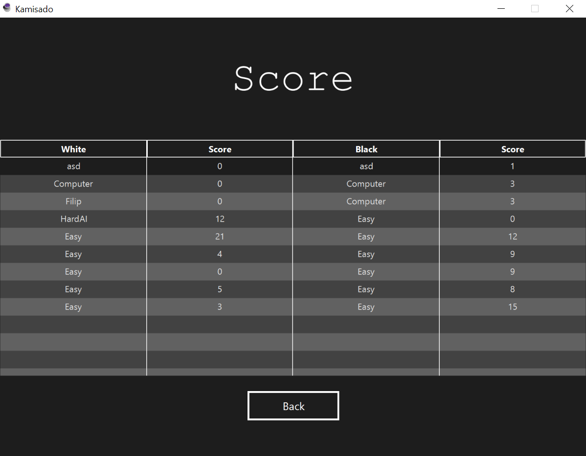

# Kamisado

An implementation of a Japanese chess-like board game Kamisado. It was made as an assignment for a programming class. The complete rules of the game can be found [here](http://www.yucata.de/en/Rules/Kamisado).

The UI was build using JavaFX. We made use of fxml files for defining the structure of the interface and created a css stylesheet to define its looks. The sprites were modeled and rendered in Blender. The AI is fairly smart and well optimized. It was built using the MiniMax algorithm with alpha-beta pruning. 

The game features different difficulties and various optional playstyle modes, such as speed mode or randomized-board-on-every-round mode. Games can be saved and loaded and all finished games are added onto the scoreboard. Data is persistent across instances in the form of a Kamisado.config file. The application also has an inbuilt soundtrack with easy-to-modify playlist file with a pleasant default instrumental music.

## Screenshots

